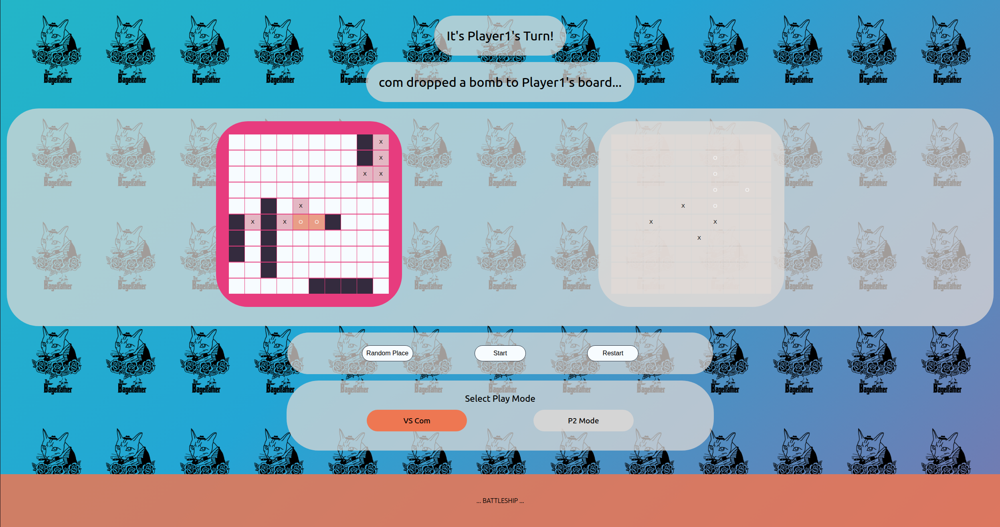
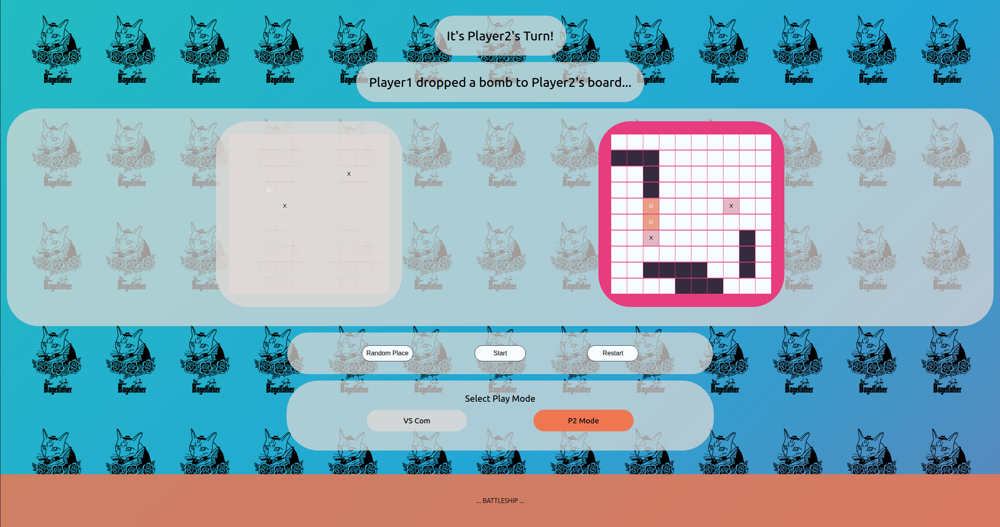

# Battleship Game

A classic Battleship game implemented as a web application, allowing players to strategically place their ships and engage in turn-based combat against a computer opponent.

## Table of Contents

- [Features](#features)
- [How to Play](#how-to-play)
- [Installation](#installation)
- [Technologies Used](#technologies-used)
- [Contributing](#contributing)
- [License](#license)

## Features

-   **Player vs. Computer (AI):** Challenge an AI opponent in a strategic naval battle.
-   **Interactive Ship Placement:** Manually place your ships on the game board or use the random placement option for quick setup.
-   **Dynamic Game Boards:** Visually track hits and misses on both your board and the opponent's board.
-   **Game Over Conditions:** Clearly indicates when all ships of a player have been sunk, declaring a winner.
-   **Responsive Design:** Playable on various screen sizes.

### Screenshots




## How to Play

1.  **Setup:** Open the `index.html` file in your web browser.
2.  **Place Your Ships:** Before the game begins, you will be prompted to place your ships on your game board. You can drag and drop ships, rotate them, or use the "Random Placement" button for an automatic setup.
3.  **Attack:** Once ships are placed, the game starts. Click on a square on the opponent's board to launch an attack.
4.  **Turns:** The game proceeds in turns. After your attack, the computer will make its move.
5.  **Win Condition:** The first player to sink all of the opponent's ships wins the game!

## Installation

To get a local copy up and running, follow these simple steps.

### Prerequisites

-   Node.js (LTS version recommended)
-   npm (comes with Node.js)

### Steps

1.  **Clone the repository:**
    ```bash
    git clone https://github.com/your-username/Battleship.git
    cd Battleship
    ```
    (Note: Replace `https://github.com/your-username/Battleship.git` with the actual repository URL if it's hosted.)

2.  **Install dependencies:**
    ```bash
    npm install
    ```

3.  **Build the project:**
    ```bash
    npm run build
    ```
    This command will compile the project and output the necessary files into the `dist/` directory.

4.  **Open the game:**
    Navigate to the `dist/` folder and open `index.html` in your preferred web browser.
    Alternatively, you can use a local server (e.g., `http-server` npm package) to serve the `dist` directory for better development experience.

## Technologies Used

-   **HTML5:** For the game structure.
-   **CSS3:** For styling and layout.
-   **JavaScript (ES6+):** For game logic and interactivity.
-   **Webpack:** For bundling JavaScript modules and assets.
-   **Babel:** For transpiling modern JavaScript to be compatible with older browsers.
-   **ESLint:** For maintaining code quality and consistency.

## Contributing

Contributions are what make the open-source community such an amazing place to learn, inspire, and create. Any contributions you make are **greatly appreciated**.

If you have a suggestion that would make this better, please fork the repo and create a pull request. You can also simply open an issue with the tag "enhancement".
Don't forget to give the project a star! Thanks again!

1.  Fork the Project
2.  Create your Feature Branch (`git checkout -b feature/AmazingFeature`)
3.  Commit your Changes (`git commit -m 'Add some AmazingFeature'`)
4.  Push to the Branch (`git push origin feature/AmazingFeature`)
5.  Open a Pull Request

## License

Distributed under the MIT License. See `LICENSE` for more information.
